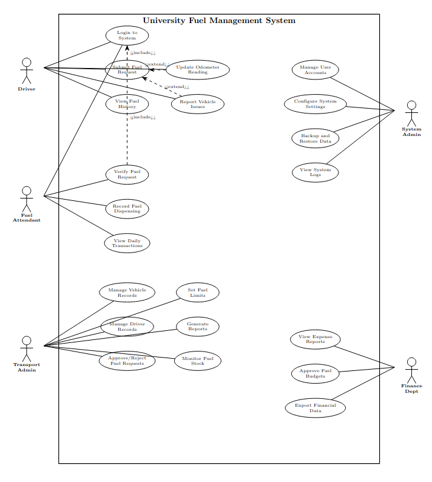
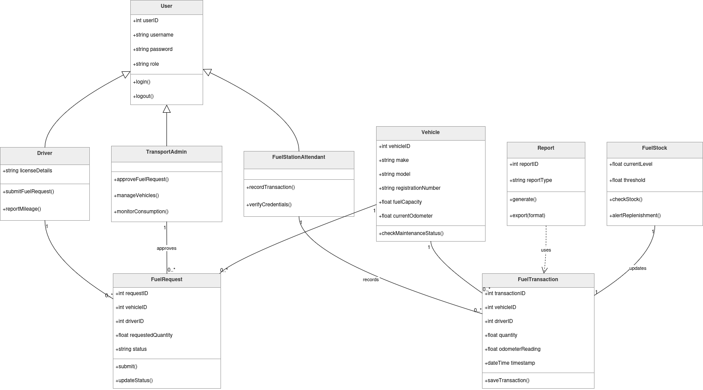
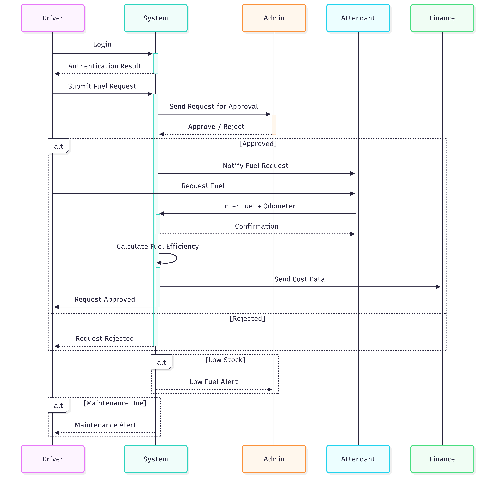
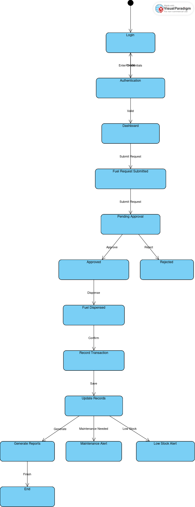
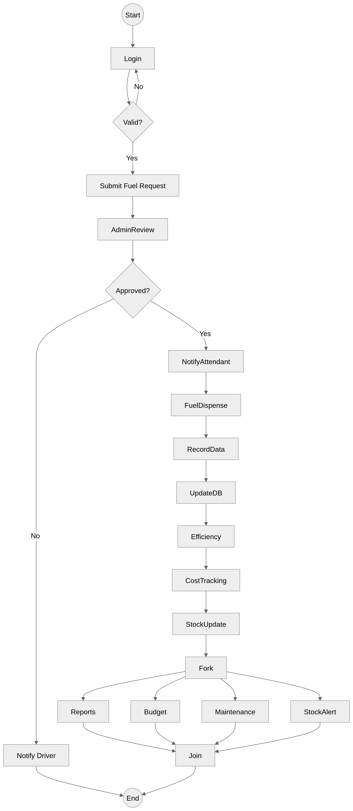

# 🏢 University Fleet & Fuel Management System (SDA)

[](#)
[](#)
[](#)
[](LICENSE)

> Complete **Software Design & Architecture (SDA)** specification, requirements engineering, and UML 2.5 behavioral & structural models for an enterprise **University Fleet Fuel Management System**.

---

## 📌 Executive Summary

FAST National University of Computer and Emerging Sciences manages a diverse transport fleet, including student transit buses, administrative sedans, and facility maintenance vehicles. Manual record-keeping for fuel distribution creates data reconciliation lag, fuel pilferage risks, and opaque audit trails.

This repository contains the complete formal software engineering documentation:
- **Requirement Elicitation & Formal Specification (FRs & NFRs)**
- **Role-Based Stakeholder Analysis**
- **Structural Models:** UML Class Diagrams with complete entity attributes and cardinalities
- **Behavioral & Dynamic Models:** Use Case Diagrams, Sequence Diagrams, State Machines, and Activity Workflows

---

## 👥 Engineering Team & Academic Context

- **Institution:** FAST National University of Computer and Emerging Sciences
- **Course:** Software Design & Architecture (SDA)
- **Supervision:** Prof. Umer Haroon
- **Authors:**
  - **Arslan Tariq** (Roll No: 24P-0610)
  - **Arif Ali** (Roll No: 24P-0736)
  - **Saad Ahmed Ijaz** (Roll No: 24P-0669)

---

## 🎯 Stakeholder Analysis & Role Hierarchy

| Stakeholder | Role Category | Primary Responsibilities |
| :--- | :--- | :--- |
| **Fleet Drivers** | Primary Operational User | Submits fuel refill requests, inputs real-time odometer readings, logs vehicle issues. |
| **Fuel Station Attendant** | Station Operator | Validates authorized fuel tokens, dispenses requested volume, records pump meter readings. |
| **Transport Administrator** | Operational Manager | Approves/rejects fuel requisition quotas, monitors fleet telemetry, schedules maintenance. |
| **Finance Department** | Financial Auditor | Reconciles fuel expenditures against departmental budgets, approves bulk fuel procurement. |
| **System Administrator** | Platform Engineer | Role-Based Access Control (RBAC), auditing system logs, backup and recovery routines. |
| **University Management** | Strategic Decision Maker | Reviews high-level analytics (monthly consumption patterns, cost per kilometer). |

---

## 📋 Requirements Specification

### Functional Requirements (FR)

| Requirement ID | Module | Description |
| :--- | :--- | :--- |
| **FR-01** | Identity & Access | Role-based authentication (RBAC) with cryptographic session management for all actor personas. |
| **FR-02** | Fleet Registry | Comprehensive vehicle profile registration (Vehicle ID, registration plate, make/model, fuel tank capacity, fuel type). |
| **FR-03** | Driver Management | Driver credentialing, licensing verification, and persistent binding to designated fleet routes/vehicles. |
| **FR-04** | Fuel Requisition | Driver initiation of fuel requisition tickets with trip purpose, route distance, and estimated liters required. |
| **FR-05** | Approval Workflow | Multi-tier validation by Transport Administrator evaluating vehicle mileage variance and historical consumption. |
| **FR-06** | Dispensing Verification | Secure point-of-sale logging at university fuel station; automated stock decrement upon nozzle cutoff. |
| **FR-07** | Telemetry & Odometer | Mandatory timestamped odometer logging before and after refueling to track real-world fuel economy (km/L). |
| **FR-08** | Reservoir Monitoring | Continuous tracking of underground fuel storage reservoirs with automatic low-level threshold alerts. |
| **FR-09** | Real-Time Reporting | Daily automated generation of fuel ledger reports categorized by department, vehicle type, and driver. |
| **FR-10** | Fiscal Analytics | Monthly financial roll-ups and anomaly detection (e.g., rapid consumption spikes indicating leaks or misuse). |
| **FR-11** | Audit Trail | Immutable audit logging of all transaction state transitions from requisition to final invoice settlement. |

### Non-Functional Requirements (NFR)

- **Security & Integrity:** Password hashing (bcrypt), tokenized authorization, and tamper-proof audit trails for all financial and fuel-dispensing actions.
- **Availability & Fault Tolerance:** System designed for 99.9% availability during peak fleet departure hours (06:00 - 09:00 PKT).
- **Usability:** High-contrast mobile-responsive interface for kiosk fuel station operators and drivers in outdoor conditions.
- **Data Consistency:** Strict ACID compliance for concurrent inventory decrements and transaction confirmations.

---

## 🏛️ System Architecture & UML Models

### 1. Use Case Diagram
Maps functional boundaries between external actors (Driver, Station Operator, Transport Admin, Finance Officer) and internal transaction systems.



---

### 2. Class Diagram
Structural domain model showing object relationships, attributes, methods, and multiplicities across Vehicle, Driver, FuelRequest, Transaction, and FuelTank entities.



---

### 3. Sequence Diagram
Dynamic interaction timeline demonstrating chronological message exchanges for a complete Fuel Request and Dispensing lifecycle: Driver requisition -> Admin verification -> Attendant validation -> Fuel dispensing -> Inventory deduction -> Notification.



---

### 4. State Machine Diagram
Formal state transitions of a `FuelRequest` entity through its lifecycle:
`[Created]` $\rightarrow$ `[Pending Approval]` $\rightarrow$ `[Approved / Rejected]` $\rightarrow$ `[Dispensing in Progress]` $\rightarrow$ `[Completed]` $\rightarrow$ `[Archived]`.



---

### 5. Activity Diagram
Visualizes parallel operational workflows, decision nodes, and exception handling for fuel authorization and inventory replenishment.



---

## 📂 Repository Structure

```text
├── docs/
│   └── diagrams/
│       ├── use_case_diagram.png       # Use Case Diagram
│       ├── class_diagram.png          # UML Class Diagram
│       ├── sequence_diagram.png       # Sequence Diagram
│       ├── state_machine_diagram.png  # State Machine Lifecycle
│       └── activity_diagram.png       # Operational Activity Flow
├── Fuel Management System_Usecase Diagram _FR_NFR.odt # Original requirements document
├── Fuel Management System_UML Diagrams.odt            # Original architectural specification
├── LICENSE                            # MIT License
└── README.md                          # Architectural overview (this file)
```

---

## 📜 License

This project is licensed under the MIT License - see the [LICENSE](LICENSE) file for details.
